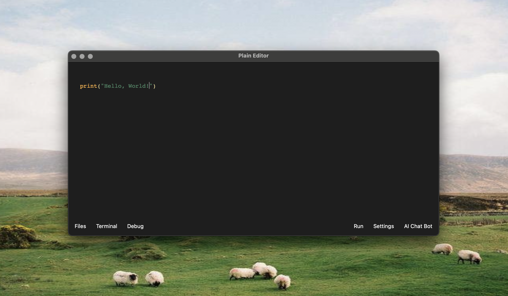

# Plain Editor

**Plain** is a super minimal, native macOS code editor — fast, distraction-free, and built for focus. It comes with a free, open-source AI coding assistant that runs *locally* to help you code smarter, without giving up your privacy.

---

### ✨ Features

- **Minimal UI** – No clutter. Just code.
- **macOS Native** – Built using Swift and SwiftUI for a smooth, fast experience.
- **AI Assistant (Local-First)** – Autocomplete, explain code, refactor, and more — all powered by an open-source model you control.
- **File Panel (optional)** – Quickly toggle files with a single button.
- **Syntax Highlighting** – Clean and readable for most major languages.
- **Open Source** – 100% free and open. Hack it, extend it, make it yours.

---

### 🧠 Local AI Assistant

Plain includes a coding assistant that runs locally on your machine. No sign-up, no cloud API, no data leaks.

- Suggests code completions
- Answers coding questions
- Can be customized or swapped with other open-source models

You’re in control — the assistant is *your* tool, not the other way around.

---

### 🚀 Why Plain?

Most editors try to do everything. Plain does almost nothing — on purpose.

- No tabs, no toolbars, no distractions.
- Starts up instantly.
- Designed for writers of code, not clickers of menus.

If you want a coding space that feels like a calm, focused notebook — Plain is for you.
